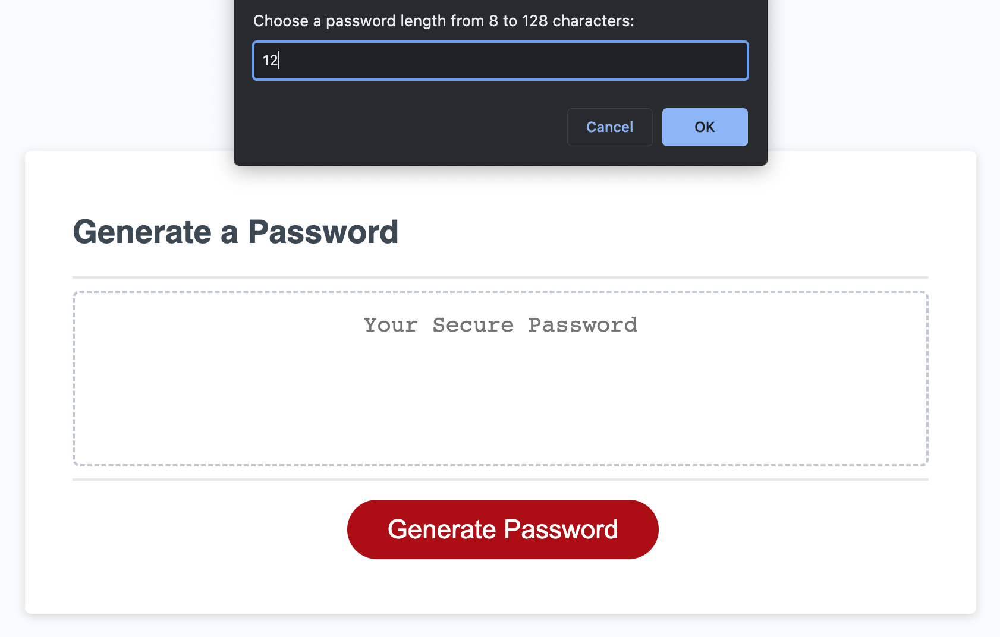
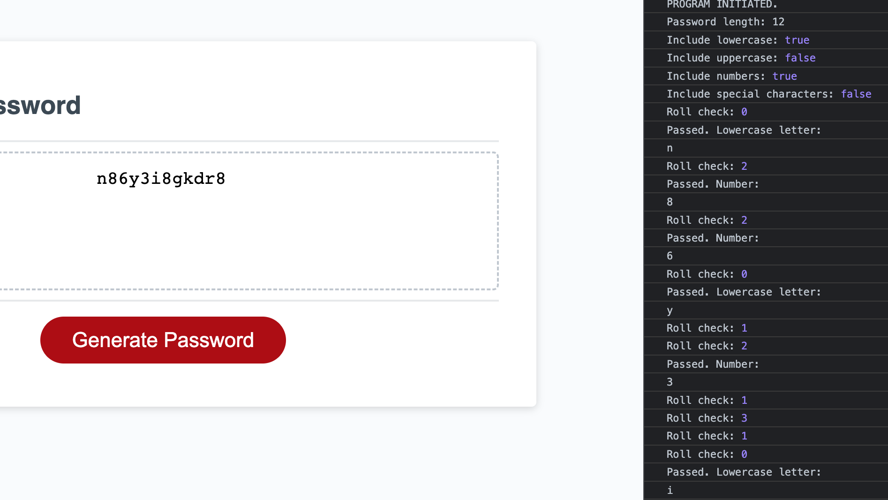

# Customizable Random Password-Generating Web Application

## Description

This application creates a randomly-generated password that conforms to several criteria, which user is first prompted to set in a series of window prompts & confirms. When user clicks "Generate Password" button, a window prompt appears asking user to enter desired number of characters, and console logs program initiation. Acceptable length entries range from 8 to 128, registered when user presses OK. If user enters a number outside this range or a non-numeric character, an alert message appears informing of error, error is logged in console, and program is terminated. If user presses CANCEL, a cancellation confirm message appears. Confirming this message triggers an alert of cancellation, terminates program, and logs user cancellation to console. Cancelling it returns user to previous window prompt. If a valid password length is entered, value is logged to console, and next four confirm windows ask user if they want to include or exclude the following character types: numbers, special characters, and upper- and lowercase letters. Each user-choice is logged to console. Once all criteria are set, a confirm window asks user if they wish to proceed with password generation. Pressing CANCEL leads to another cancellation confirm message. Confirming this message triggers alert of cancellation, terminates program, and logs user cancellation to console. Cancelling it returns user to previous window confirm. If user presses OK, password is generated and displayed in center of webpage, and additional functionality data is logged to console. This data demonstrates random type-and-character-selecting mechanism according to user-defined parameters, reports final program output, and marks end of program. Program is readily repeatable and self-resetting -- reloading page not required.
\
\
This image shows user being prompted to define password length parameter, and entering '12.'

\
\
This image shows end-result of a randomly-generated password with user's desired length and other criteria. These criteria are logged in console to the right, along with other functionality data.

## Installation

N/A

## Usage

To generate a password, click the red "Generate Password" button on the webpage and follow the series of window prompts. Once a password is generated or the program is otherwise terminated, a new password is ready to be generated by following the same process. For additional insight into the application and its functionality, open the web console.

## Credits

N/A, original code with the exception of bare-bones starter code provided by UNC Chapel Hill Coding Bootcamp.

## License

Refer to license in the repo.